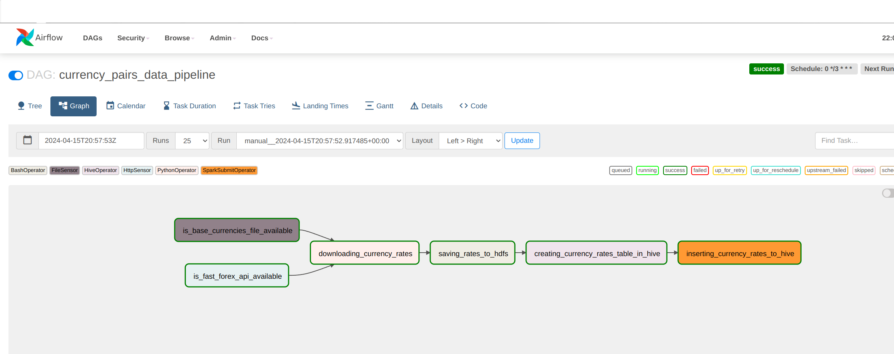

# Currency pairs data pipeline using Apache Airflow


### Superset init
With your local superset container already running...
```console 
docker exec -it superset superset fab create-admin \
--username admin \
--firstname Superset \
--lastname Admin \
--email admin@superset.com \
--password admin
```
```console 
docker exec -it superset superset db upgrade
```
```console
docker exec -it superset superset load_examples
```

```console 
docker exec -it superset superset init
```